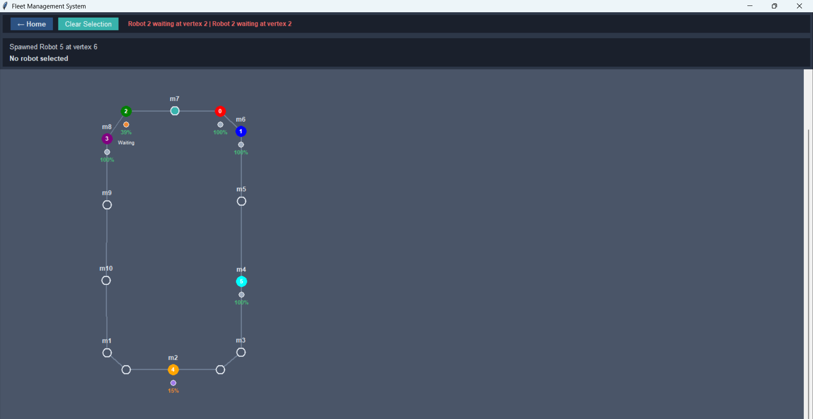
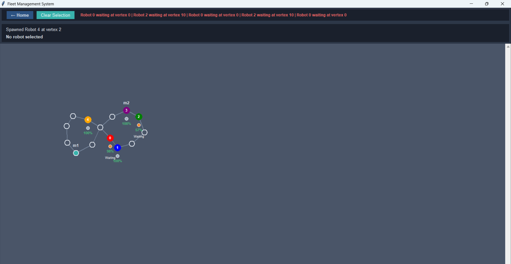
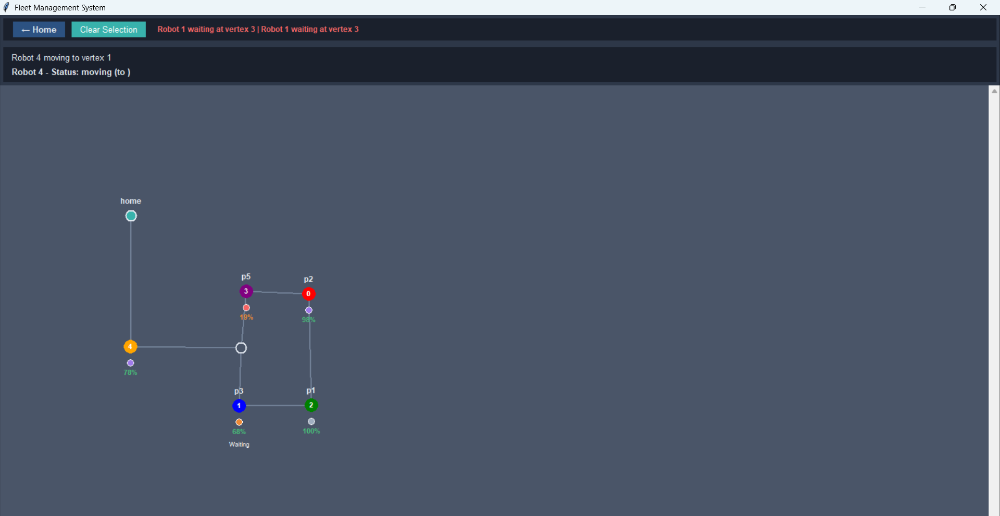
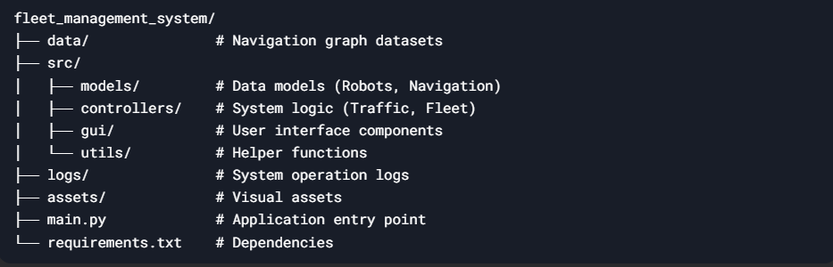

# Fleet Management System with Multi-Robot Traffic Negotiation

<br>

## 🚀 Overview
A Python-based simulation system for managing multiple autonomous robots navigating through warehouse environments with:
- Real-time traffic negotiation
- Collision avoidance
- Dynamic task assignment
- Battery management with charging stations

<br>

## ✨ Features
- **3 Distinct Levels** with progressive difficulty
  - 🟢 Level 1: Basic Warehouse, Small network with 14 locations, 2 charging stations
  - 🟡 Level 2: Medium Facility, Medium network with 14 locations, 1 charging station 
  - 🔴 Level 3: Large Distribution Center, Medium network with 7 locations, 1 charging station 
- **Interactive GUI** with intuitive controls
- **Smart Robot Behaviors**:
  - Pathfinding with obstacle avoidance
  - Battery consumption/charging
  - Traffic deadlock resolution
- **Visualization Tools**:
  - Real-time robot tracking
  - Status indicators (moving, waiting, charging)
  - Conflict notifications
- **Path Finding Algorithm**:
  - Breadth First Search(BFS)

## Controls:

1. Click on vertices to spawn robots
2. Select a robot then click destination to assign tasks
3. Ctrl+D decreases selected robot's battery (for testing)
4. View real-time logs in logs/fleet_logs.txt

## 🗺️ Level Designs:

#### 1. Level 1 
<br>

#### 2. Level 2
<br>

#### 3. Level 3
<br>

## 🏗️ Project Structure
<br>


## Completed Features in Hackathon:
### 1. Visual Representation
#### ✓ Environment Visualization:

Displayed all vertices (locations) and lanes clearly.
Marked locations with names and intersections.
Made vertices interactable (clickable) for spawning robots or assigning tasks.

#### ✓ Robot Visualization:

  Used distinct colors/icons for robots.
  Implemented real-time movement visualization along lanes.
  Displayed robot statuses (moving, waiting, charging, task complete).

### 2. Robot Spawning
#### ✓ Interactive GUI:

Enabled dynamic robot spawning by clicking vertices.
Assigned and displayed unique identifiers for each robot.

### 3. Navigation Task Assignment
#### ✓ Interactive Task Assignment:

Allowed robot selection and destination assignment via clicks.
Robots started navigation immediately after task assignment.

### 4. Traffic Negotiation & Collision Avoidance
#### ✓ Real-Time Traffic Management:

Implemented lane/intersection queuing to avoid collisions.
Visualized waiting status (e.g., color changes, icons).

### 5. Dynamic Interaction
#### ✓ Runtime Flexibility:

Supported real-time robot spawning/task assignment without interrupting active robots.

### 6. Occupancy and Conflict Notifications
#### ✓ User Alerts:

Provided visual notifications for blocked paths/vertices.

### 7. Logging & Monitoring
#### ✓ Detailed Logging:

Logged robot actions, paths, and statuses in fleet_logs.txt.


### Bonus 
#### ✓ Creative Enhancements:
1. Improved Robot intelligence so that it can easily find alternate paths, when it's shortest path is blocked by another robot.
2. If Robot battery drops below 20%, it automatically moves to nearest charging station to recharge itself(if in case,it's nearest charging station path is blocked, robot intelligently moves to other charging station or finds alternate path for that nearest charging station).
3. Added Functionality for reducing the charge of robot manually (for testing purposes).


## 📦 Installation
1. Clone the repository:
   ```bash
   git clone https://github.com/yourusername/fleet-management-system.git
   cd fleet-management-system

2. Install dependencies:
   ```bash
   pip install -r requirements.txt

## 🖥️ Usage
1. Run the main application::
   ```bash
   python main.py


## 🛠️ Customization
1. Add new levels by creating JSON files in data/ following the existing format
2. Modify robot behaviors in src/models/robot.py
3. Adjust simulation parameters:
    (a)Robot speed
    (b)Battery consumption rates
    

Developed with ❤️ by Laxman
