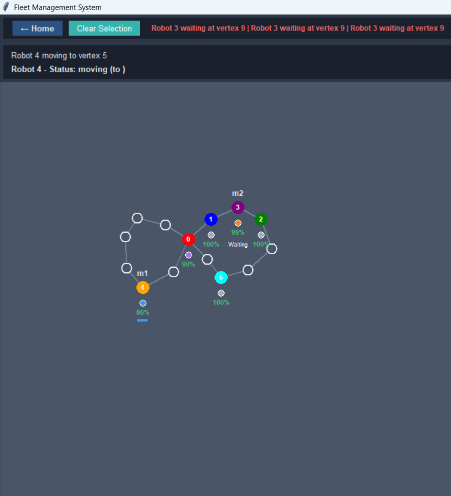

# Fleet Management System with Multi-Robot Traffic Negotiation

<br>

## 🚀 Overview
A Python-based simulation system for managing multiple autonomous robots navigating through warehouse environments with:
- Real-time traffic negotiation
- Collision avoidance
- Dynamic task assignment
- Battery management with charging stations

<br>

## ✨ Features
- **3 Distinct Levels** with progressive difficulty
  - 🟢 Training Grounds (Beginner)
  - 🟡 Distribution Hub (Intermediate)
  - 🔴 Megawarehouse (Advanced)
- **Interactive GUI** with intuitive controls
- **Smart Robot Behaviors**:
  - Pathfinding with obstacle avoidance
  - Battery consumption/charging
  - Traffic deadlock resolution
- **Visualization Tools**:
  - Real-time robot tracking
  - Status indicators (moving, waiting, charging)
  - Conflict notifications

## 📦 Installation
1. Clone the repository:
   ```bash
   git clone https://github.com/yourusername/fleet-management-system.git
   cd fleet-management-system

2. Install dependencies:
   ```bash
   pip install -r requirements.txt

## 🖥️ Usage
1. Run the main application::
   ```bash
   python main.py

## Controls:

1. Click on vertices to spawn robots
2. Select a robot then click destination to assign tasks
3. Ctrl+D decreases selected robot's battery (for testing)
4. View real-time logs in logs/fleet_logs.txt

## 🗺️ Level Designs:

# 1. Level 1 
<br>

# 2. Level 2
<br>

# 3. Level 3
<br>

## 🏗️ Project Structure
  


## 🛠️ Customization
1. Add new levels by creating JSON files in data/ following the existing format
2. Modify robot behaviors in src/models/robot.py
3. Adjust simulation parameters:
    (a)Robot speed
    (b)Battery consumption rates
    

Developed with ❤️ by Laxman
